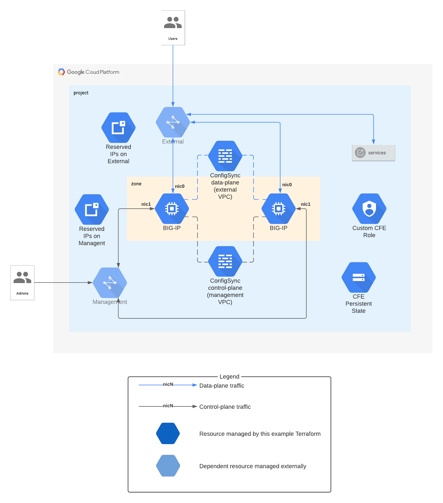

# Cloud Failover Extension sub-module in a 2-NIC configuration deployed to multiple availability zones

> You are viewing a **1.x release** of the modules, which supports
> **Terraform 0.12** only. *For modules compatible with Terraform 0.13 and 0.14,
> use a 2.x release.* Functionality is identical, but separate releases are required
> due to the difference in *variable validation* between Terraform 0.12 and 0.13+.

This example demonstrates how to use the
[CFE sub-module](https://registry.terraform.io/modules/memes/f5-bigip/google/latest/submodules/cfe)
to deploy a pair of BIG-IP instances in a 2-NIC configuration, with
[Cloud Failover Extension](https://clouddocs.f5.com/products/extensions/f5-cloud-failover/latest/)
installed and configured. The instances will be deployed in separate AZs in
a round-robin assignment.

> **NOTE:** This example does not include firewall rules, ingress routes, or any
> other dependencies needed to for a fully-functional deployment. The intent is
> only to demonstrate how to *add* a CFE-based BIG-IP component to a broader
> deployment.



<!-- spell-checker: ignore tfvars gserviceaccount mgmt bigip -->
## Example tfvars file

* Deploy to project: `my-project-id`
* Deploy BIG-IPs to zones: `us-west1-c` and `us-west1-a`
* Assign BIG-IP data-plane to VPC: `external` in `us-west1` subnet `ext-west`
* Assign BIG-IP control-plane to VPC: `management` in `us-west1` subnet `mgmt-west`
* BIG-IP will use service account: `bigip@my-project-id.iam.gserviceaccount.com`
* BIG-IP admin user password is stored in Secret Manager under the key:
  `bigip-admin-password-key`

<!-- spell-checker: disable -->
```hcl
project_id             = "my-project-id"
zones                  = ["us-west1-c", "us-west1-a"]
external_network       = "https://www.googleapis.com/compute/v1/projects/my-project-id/global/networks/external"
external_subnet        = "https://www.googleapis.com/compute/v1/projects/my-project-id/regions/us-west1/subnetworks/ext-west"
management_network     = "https://www.googleapis.com/compute/v1/projects/my-project-id/global/networks/management"
management_subnet      = "https://www.googleapis.com/compute/v1/projects/my-project-id/regions/us-west1/subnetworks/mgmt-west"
admin_password_key     = "bigip-admin-password-key"
service_account        = "bigip@my-project-id.iam.gserviceaccount.com"
```
<!-- spell-checker: enable -->

### Prerequisites

* VPC networks for `external` and `management` with subnets in region where the
  BIG-IPs will be deployed
* Service account to be used by BIG-IP VMs
* BIG-IP admin account password stored in Secret Manager, with `read` access
  granted to BIG-IP service account

### Resources created

<!-- spell-checker: ignore payg -->
* 2x VMs running BIG-IP v15.1 PAYG license, deployed to `us-west1-c` and `us-west1-a`
* 3 reserved internal IP addresses on `external` VPC network
  * 2 addresses will be assigned to BIG-IP instances
  * 1 will be used for a VIP that will be assigned to the active BIG-IP as an
    alias IP
* 2 reserved internal IP addresses on `management` VPC network; these will be
  assigned to management interface on BIG-IP instances
* Custom CFE IAM role created and assigned to BIG-IP service account
* Cloud Storage bucket for CFE shared state; BIG-IP service account will be
  granted read-write access to bucket
* Firewall rules to permit BIG-IP ConfigSync traffic on `management` and
  `external` VPC networks, limited to VMs using BIG-IP service account

### External modules used in example

* Google [Cloud Storage](https://registry.terraform.io/modules/terraform-google-modules/cloud-storage/google/1.7.2)

<!-- spell-checker:ignore markdownlint -->
<!-- markdownlint-disable MD033 MD034-->
<!-- BEGINNING OF PRE-COMMIT-TERRAFORM DOCS HOOK -->
## Requirements

| Name | Version |
|------|---------|
| terraform | ~> 0.12.28, < 0.13 |

## Providers

| Name | Version |
|------|---------|
| google | n/a |
| random | n/a |

## Inputs

| Name | Description | Type | Default | Required |
|------|-------------|------|---------|:--------:|
| admin\_password\_key | The Secret Manager key to lookup and retrive admin user password during<br>initialization. | `string` | n/a | yes |
| external\_network | The fully-qualified network self-link for the *external* network to which CFE<br>firewall rules will be deployed. | `string` | n/a | yes |
| external\_subnet | The fully-qualified subnetwork self-link to attach to the BIG-IP VM \*external\*<br>interface. | `string` | n/a | yes |
| management\_network | The fully-qualified network self-link for the *management* network to which CFE<br>firewall rules will be deployed. | `string` | n/a | yes |
| management\_subnet | The fully-qualified subnetwork self-link to attach to the BIG-IP VM \*management\*<br>interface. | `string` | n/a | yes |
| project\_id | The GCP project identifier where the cluster will be created. | `string` | n/a | yes |
| service\_account | The service account to use for BIG-IP VMs. | `string` | n/a | yes |
| zones | The list of compute zones which will host the BIG-IP VMs. | `list(string)` | n/a | yes |
| image | The BIG-IP image to use. Defaults to the latest v15 PAYG/good/5gbps<br>release as of the publishing of this module. | `string` | `"projects/f5-7626-networks-public/global/images/f5-bigip-15-1-2-0-0-9-payg-good-5gbps-201110225418"` | no |
| num\_instances | The number of BIG-IP instances to create. Default is 2. | `number` | `2` | no |

## Outputs

| Name | Description |
|------|-------------|
| instance\_self\_links | Self-link of the BIG-IP instances. |

<!-- END OF PRE-COMMIT-TERRAFORM DOCS HOOK -->
<!-- markdownlint-enable MD033 MD034 -->
