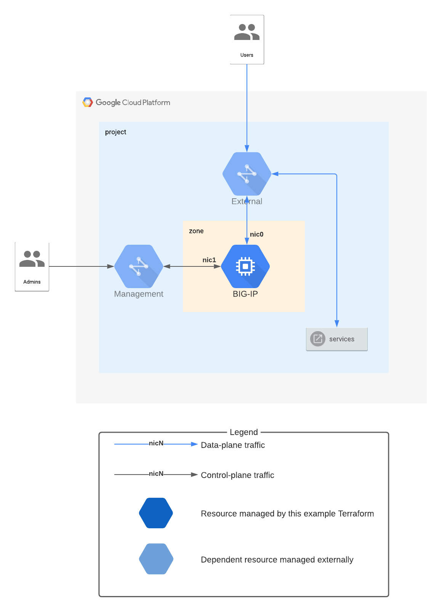

# Standalone BIG-IP with 2-NIC deployment

> You are viewing a **1.x release** of the modules, which supports
> **Terraform 0.12** only. *For modules compatible with Terraform 0.13, use a
> 2.x release.* Functionality is identical, but separate releases are required
> due to the difference in *variable validation* between Terraform 0.12 and 0.13.

This example demonstrates how to use the
[BIG-IP module](https://registry.terraform.io/modules/memes/f5-bigip/google/latest)
to deploy a single BIG-IP instance in a 2-NIC configuration.

> **NOTE:** This example does not include firewall rules, ingress routes, or any
> other dependencies needed to for a fully-functional deployment. The intent is
> only to demonstrate how to *add* a single BIG-IP component to a broader
> deployment.



<!-- spell-checker: ignore tfvars gserviceaccount mgmt bigip -->
## Example tfvars file

* Deploy to project: `my-project-id`
* Deploy BIG-IP to zone: `us-west1-c`
* Assign BIG-IP data-plane to VPC: `us-west1` subnet `ext-west`
* Assign BIG-IP control-plane to VPC: `us-west1` subnet `mgmt-west`
* BIG-IP will use service account: `bigip@my-project-id.iam.gserviceaccount.com`
* BIG-IP admin user password is stored in Secret Manager under the key:
  `bigip-admin-password-key`

<!-- spell-checker: disable -->
```hcl
project_id         = "my-project-id"
zone               = "us-west1-c"
external_subnet    = "https://www.googleapis.com/compute/v1/projects/my-project-id/regions/us-west1/subnetworks/ext-west"
management_subnet  = "https://www.googleapis.com/compute/v1/projects/my-project-id/regions/us-west1/subnetworks/mgmt-west"
admin_password_key = "bigip-admin-password-key"
service_account    = "bigip@my-project-id.iam.gserviceaccount.com"
```
<!-- spell-checker: enable -->

### Prerequisites

* VPC networks for `external`, and `management` with subnets in region where the
  BIG-IP will be deployed
* Service account to be used by BIG-IP VM
* BIG-IP admin account password stored in Secret Manager, with `read` access
  granted to BIG-IP service account

### Resources created

<!-- spell-checker: ignore payg -->
* 1x VM running BIG-IP v15.1 PAYG license

<!-- spell-checker:ignore markdownlint -->
<!-- markdownlint-disable MD033 MD034-->
<!-- BEGINNING OF PRE-COMMIT-TERRAFORM DOCS HOOK -->
## Requirements

| Name | Version |
|------|---------|
| terraform | ~> 0.12.28, < 0.13 |

## Providers

No provider.

## Inputs

| Name | Description | Type | Default | Required |
|------|-------------|------|---------|:--------:|
| admin\_password\_key | The Secret Manager key to lookup and retrive admin user password during<br>initialization. | `string` | n/a | yes |
| external\_subnet | The fully-qualified subnetwork self-link to attach to the BIG-IP VM \*external\*<br>interface. | `string` | n/a | yes |
| management\_subnet | The fully-qualified subnetwork self-link to attach to the BIG-IP VM \*management\*<br>interface. | `string` | n/a | yes |
| project\_id | The GCP project identifier where the cluster will be created. | `string` | n/a | yes |
| service\_account | The service account to use for BIG-IP VMs. | `string` | n/a | yes |
| zone | The compute zone which will host the BIG-IP VMs. | `string` | n/a | yes |
| image | The BIG-IP image to use. Defaults to the latest v15 PAYG/good/5gbps<br>release as of the publishing of this module. | `string` | `"projects/f5-7626-networks-public/global/images/f5-bigip-15-1-2-0-0-9-payg-good-5gbps-201110225418"` | no |

## Outputs

| Name | Description |
|------|-------------|
| instance\_self\_link | Self-link of the BIG-IP instance. |

<!-- END OF PRE-COMMIT-TERRAFORM DOCS HOOK -->
<!-- markdownlint-enable MD033 MD034 -->
